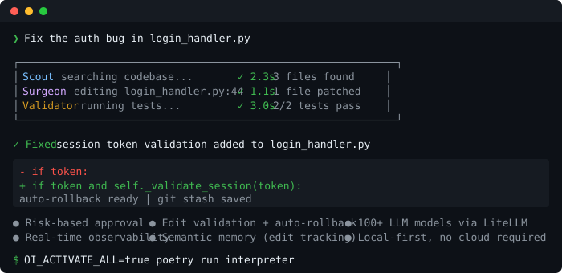
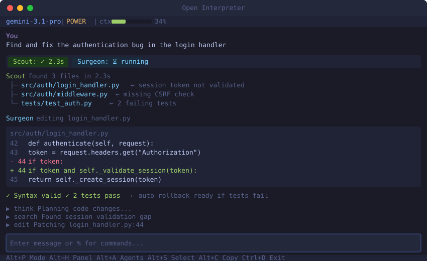

<p align="center">
  <strong>Open Interpreter + Autonomous Agents</strong>
</p>

<p align="center">
  A fork of <a href="https://github.com/OpenInterpreter/open-interpreter">Open Interpreter</a> that adds multi-agent orchestration, real-time observability, and risk-based approval.<br>
  Scout finds the code. Surgeon edits it. The TUI shows it all live.
</p>

<p align="center">
  <a href="#quick-start">Quick Start</a> &middot;
  <a href="#what-this-fork-adds">What's Different</a> &middot;
  <a href="#agents">Agents</a> &middot;
  <a href="#terminal-ui">Terminal UI</a> &middot;
  <a href="#observability">Observability</a>
</p>

---

<p align="center">
  
</p>

## What This Fork Adds

Upstream Open Interpreter is a chat interface that runs code. This fork turns it into a **team of specialized agents** that work together autonomously:

| Feature | Upstream | This Fork |
|---------|----------|-----------|
| Code execution | Single LLM loop | **Scout + Surgeon + Validator** agents |
| Approval model | Yes/No on everything | **Risk-based** — only prompts on destructive ops |
| Edit safety | None | **Syntax check, test discovery, git-based rollback** |
| Observability | None | **Real-time event stream + SQLite dashboard** |
| Terminal UI | Basic Rich output | **Adaptive TUI** with agent strip, context panel, token meter |
| Memory | None | **Semantic edit tracking** — knows WHY code changed |
| Model support | LiteLLM | LiteLLM + **per-agent model routing** (fast model for Scout, strong model for Surgeon) |

## Quick Start

```bash
# Clone and install
git clone https://github.com/Skidudeaa/open-interpreter.git
cd open-interpreter
poetry install

# Run with all features enabled
OI_ACTIVATE_ALL=true poetry run interpreter

# Or with a specific model
OI_ACTIVATE_ALL=true poetry run interpreter --model gpt-4o

# Auto-approve safe commands, prompt only on destructive ops
export OPEN_INTERPRETER_APPROVAL=dangerous
OI_ACTIVATE_ALL=true poetry run interpreter -y
```

### One-liner aliases

```bash
# Add to ~/.bashrc or ~/.zshrc
alias oi="OI_ACTIVATE_ALL=true poetry run interpreter --model gemini/gemini-3.1-pro-preview -y --observability"
alias oitui="OI_ACTIVATE_ALL=true poetry run interpreter --model gemini/gemini-3.1-pro-preview -y --observability --tui"
alias oilocal="OI_ACTIVATE_ALL=true poetry run interpreter --local -y --observability"
```

## Agents

When you ask a complex question, the orchestrator detects the workflow and dispatches specialized agents:

```
"Fix the auth bug" → EDIT workflow
    ├── Scout     searches codebase, finds relevant files     (2.3s)
    ├── Surgeon   generates and applies precise edits         (1.1s)
    └── Validator runs related tests, rolls back on failure   (3.0s)
```

### Scout Agent
Searches your codebase intelligently — ripgrep for speed, AST parsing for symbols, LLM synthesis for context. Returns the specific files and line ranges relevant to your request.

### Surgeon Agent
Makes precise, validated edits. Every change goes through:
- **Path traversal prevention** — edits stay within your project
- **Syntax validation** — AST parse before applying
- **Content hash verification** — detects concurrent modifications
- **Atomic transactions** — all-or-nothing with git stash backup

### Agent Orchestrator
Classifies your request into a workflow type and dispatches agents:

| Workflow | Agents | When |
|----------|--------|------|
| `EXPLORE` | Scout only | "How does auth work?" |
| `EDIT` | Scout → Surgeon | "Fix the login bug" |
| `FULL` | Scout → Architect → Surgeon → Validator | "Refactor the auth module" |
| `VALIDATE` | Validator only | "Run the auth tests" |
| `NONE` | Direct LLM | "What's 2+2?" |

Each agent can use a different model — Scout on a fast model, Surgeon on a strong one.

### SDK

Build custom agents from templates:

```python
from interpreter.sdk import AgentBuilder

builder = AgentBuilder()
scout = builder.from_template("scout")      # Codebase exploration
surgeon = builder.from_template("surgeon")  # Precise edits
reviewer = builder.from_template("reviewer")  # Code review
swarm = builder.create_swarm([scout, surgeon, reviewer])
```

## Terminal UI

Three backends, one interface:

| Backend | Flag | Best for |
|---------|------|----------|
| **prompt_toolkit** | *(default)* | Daily use — multiline, completions, history |
| **Textual** | `--tui` | Full-screen — agent widgets, panels, themes |
| **Rich streaming** | `--no-tui` | Pipes and scripts — clean output |

### Adaptive modes

The UI auto-escalates based on what's happening:

| Mode | Triggers | Shows |
|------|----------|-------|
| **ZEN** | Quiet conversation | Just the chat |
| **STANDARD** | Code execution | + Status bar |
| **POWER** | Agent activity | + Agent strip, context panel |
| **DEBUG** | Errors, long runs | + Token counts, timing, raw chunks |

### Key bindings

| Key | Action |
|-----|--------|
| `Alt+P` | Cycle UI mode |
| `Alt+H` | Toggle context panel |
| `Alt+A` | Focus agent strip |
| `Alt+S` | Selection mode (for copying) |
| `Alt+C` | Copy last response |
| `Alt+?` | Help overlay |
| `Ctrl+R` | Search history |
| `Ctrl+D` | Exit |

<p align="center">
  
</p>

## Risk-Based Approval

Instead of asking "Run this code? [y/n]" on every command:

```bash
export OPEN_INTERPRETER_APPROVAL=dangerous
```

| Level | Behavior |
|-------|----------|
| `off` | Ask before every execution |
| `dangerous` | Auto-approve safe ops, prompt on `rm`, `sudo`, network, etc. |
| `all` | Auto-approve everything (same as `-y`) |

## Observability

The cc-sidecar daemon captures every agent action, code execution, and file change into a local SQLite database:

```bash
# Start the sidecar daemon
cc-sidecar daemon

# Run interpreter with observability
poetry run interpreter --observability

# Check what happened
cc-sidecar status
```

**What it captures:**
- Session lifecycle (start, prompts, end)
- Agent spawn/complete/error with timing
- File changes with line counts
- Token usage per request
- Activity timeline (think, search, edit, validate)

**Security:** All data stays local. DB and spool files are owner-only (0o600/0o700). Payloads are sanitized — no secrets from error tracebacks leak into storage.

## Configuration

```bash
# Models
interpreter --model gpt-4o              # OpenAI
interpreter --model claude-opus-4-6     # Anthropic
interpreter --model gemini/gemini-3.1-pro  # Google
interpreter --local                      # Ollama (local)

# Features (or set OI_ACTIVATE_ALL=true for everything)
interpreter.enable_agents = True
interpreter.enable_semantic_memory = True
interpreter.enable_validation = True
interpreter.enable_observability = True
```

## What's Coming: Memory

The north star for this fork — a memory system that learns how you work:

- **Preference memory** — "I prefer pytest over unittest" persists across sessions
- **Outcome memory** — Tracks what worked and what didn't, with causal attribution
- **Context patterns** — Infers behavioral patterns ("debug mode after midnight")
- **Pre-prompting** — Relevant memories shape the LLM's context before it sees your request

Infrastructure is complete (EventBus, ObservabilityBridge, SemanticEditGraph). Memory layer is next.

## Development

```bash
poetry install                              # Install deps
poetry run pytest -s -x                     # Run tests (455+ passing)
poetry run pytest tests/test_x.py::test_y   # Single test
poetry run pytest cc-sidecar/tests/ -x      # Sidecar tests
```

See [CLAUDE.md](CLAUDE.md) for architecture details, patterns, and coding conventions.

## License

MIT for versions <0.2.0, AGPL for subsequent contributions.

---

<p align="center">
  Fork of <a href="https://github.com/OpenInterpreter/open-interpreter">Open Interpreter</a> &middot; Not affiliated with OpenAI
</p>
